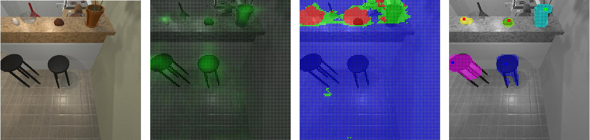
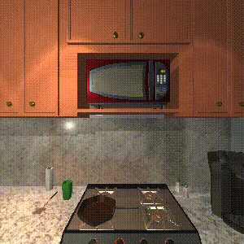

# [Learning About Objects by Learning to Interact with Them](https://arxiv.org/pdf/2006.09306.pdf)

By Martin Lohmann, Jordi Salvador, Aniruddha Kembhavi, and Roozbeh Mottaghi

We present a computational framework to discover objects and learn their physical properties along the paradigm of
Learning from Interaction. Our agent, when placed within the AI2-THOR environment, interacts with its world by
applying forces, and uses the resulting raw visual changes to learn instance segmentation and relative mass estimation
of interactable objects, without access to ground truth labels or external guidance. Our agent learns efficiently and
effectively; not just for objects it has interacted with before, but also for novel instances from seen categories
as well as novel object categories.



## Citing
```
@inproceedings{ml2020learnfromint,
  author = {Lohmann, Martin and Salvador, Jordi and Kembhavi, Aniruddha and Mottaghi, Roozbeh},
  title = {Learning About Objects by Learning to Interact with Them},
  booktitle = {NeurIPS},
  year = {2020}
}
```

## Setup

#### Requirements

This code has been developed and tested on Ubuntu 16.04.4 LTS. We assume xserver-xorg is installed, and
CUDA drivers are available along at least two compute devices (with 12 GB of memory each) for training or one device
for evaluation. We use `python3.6`.

#### Structure

The following subfolders are available:
- `dataset`, containing training and test datasets for both `NovelSpaces` and
`NovelObjects` scenarios.
- `source`, containing the training and eval scripts as well as all used classes structured in several folders and a
`requirements.txt` file.
- `trained_model_novel_spaces` and `trained_model_novel_objects`, containing the trained model weights used for the
results reported in the manuscript for the corresponding datasets.
   
#### Environment
    
We recommend creating a virtual environment with `python3.6` to run the code. For example, from the top
level folder, we can run
- `python3.6 -mvenv learnfromint` or
- `virtualenv --python=python3.6 learnfromint`.

Then, we can activate it by `source learnfromint/bin/activate`.

In order to install all python requirements, we can:
- `cd source`,
- `cat requirements.txt | xargs -n 1 -L 1 pip3 install`, and
- `python3.6 -c "import ai2thor.controller; ai2thor.controller.Controller(download_only=True)"`, which will download
the required binaries for AI2-THOR.

## Running the code

#### Training

If xorg is not already running (even if it is installed), we provide a utility script that must be run as root:
- `sudo python3.6 startx.py &> ~/logxserver &`

Then, we can run the training script from the `source` folder:
- `python3.6 train.py [output_folder] ../dataset 0` for `NovelObjects`, or
- `python3.6 train.py [output_folder] ../dataset 1` for `NovelSpaces`.

Note that, depending on the compute capabilities of the machine, training can take in the order of 2 days to
complete.
    
#### Evaluation

Again, make sure xorg is running or `sudo python3.6 startx.py &> ~/logxserver &`.

Then, we can for example run eval on the pretrained models from the `source` folder:
- `python3.6 eval.py ../trained_model_novel_objects ../dataset 0 &> ../log_eval0 &` for `NovelObjects`, or
- `python3.6 eval.py ../trained_model_novel_spaces ../dataset 1 &> ../log_eval1 &` for `NovelSpaces`

and track the results by e.g.
- `tail -f ../log_eval0`

In order to access a summary of the results, once the evaluation is complete, we can just
- `cat ../log_eval0 | grep RESULTS`
    
## Evaluation

#### About stochasticity
Even though our model does not require interaction at test time, to minimize storage space and data downloads, we
provide our evaluation dataset in this release in terms of AI2-THOR controller states. Some minor stochasticity is
involved when the controller renders these states into model inputs (images) and ground truth labels. For this reason,
the evaluation metrics for a model checkpoint can fluctuate slightly.

#### Results
The results obtained by the `eval.py` script should fluctuate around the following values:

|   Dataset   | BBox AP50 | BBox AP | Segm AP50 | Segm AP | Mass+BBox AP50 | Mass mean per-class accuracy |
|:------------|:---------:|:-------:|:---------:|:-------:|:--------------:|:----------------------------:|
| NovelObjects|   24.19   |  11.65  |   22.00   |  10.24  |      11.85     |            50.79             |
| NovelSpaces |   27.59   |  13.44  |   25.01   |  11.00  |      11.01     |            55.86             |

#### Qualitative example
Here is an illustration of the different ingredients of our training process:

